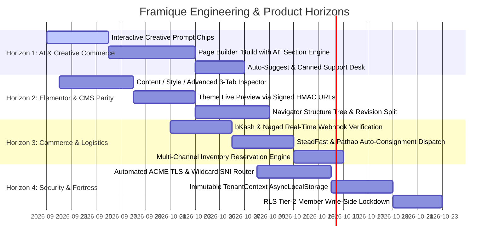

# Framique Product & Engineering Roadmap (ROADMAP.md)

> **Vision**: The premier WordPress-grade Cloud Commerce CMS & Platform for Bangladesh — pairing high-speed full-stack infrastructure with an Elementor-grade visual builder, localized payment/courier rails, and intelligent creative AI.

---

## 🧭 Milestone Overview

---

## 1. 🤖 Horizon 1: AI Copilot & Creative Suite

### 1.1 Interactive Creative Prompt Chips

- **Target Surface**: `/dashboard/ai/assistant` and the DeepWiki Copilot floating drawer.
- **Features**:
  - One-click inspirational prompt chips categorized by merchant journey:
    - 🌟 **Copywriting**: _"Generate 5 catchy slogans for my Eid fashion collection"_
    - 🎨 **Branding & Design**: _"Suggest a luxury color palette and typography for a Jamdani sari boutique"_
    - 📣 **Campaigns**: _"Plan a Pohela Boishakh flash sale strategy with coupon tiers"_
    - 📦 **Catalog**: _"Write an SEO-optimized product description for organic Sundarbans honey"_
    - 🚚 **Logistics**: _"How do I connect SteadFast and Pathao courier APIs?"_
  - Contextual injection: Automatically feeds merchant's store category, active theme, and top products into the prompt context.

### 1.2 Page Builder "Build with AI" Section Engine (Elementor Angie AI Parity)

- **Target Surface**: Visual Page Builder canvas (`/dashboard/builder`).
- **Features**:
  - Modal with prompt input: _"Add a 3-column artisan story section with circular portraits, gold badges, and quote callouts"_.
  - LLM returns structured JSON matching `BuilderNode` AST specification (`src/lib/builder-ast.ts`).
  - AST validator sanitizes nodes against schema, automatically binds demo media, and appends into the active canvas.
  - Live preview with "Keep", "Regenerate", or "Discard" actions.

### 1.3 Smart Support Desk & Canned Response Assistant

- **Target Surface**: `/dashboard/customers/support`.
- **Features**:
  - Real-time response drafting for human agents handling escalated tickets.
  - 1-click canned responses localized in professional Bengali and English.
  - Sentiment and urgency scoring for inbound customer inquiries.

---

## 2. 🎨 Horizon 2: WordPress & Elementor CMS Parity

### 2.1 Content / Style / Advanced 3-Tab Inspector Contract

- **Target Surface**: Page Builder Sidebar Inspector (`SectionInspector.tsx` / `WidgetTray.tsx`).
- **Features**:
  - Reorganize flat property forms into standard Elementor 3-tab architecture:
    - **Content Tab**: Data fields, headlines, body copy, images, CTA links, collection bindings.
    - **Style Tab**: Background fills/gradients, typography (font family, weight, line-height), text colors, borders, shadows, border-radius.
    - **Advanced Tab**: Margin/padding sliders (linked/unlinked), z-index, responsive display rules (Hide on Mobile/Tablet/Desktop), custom CSS classes, entrance motion effects (`gsap`).
  - Device toggle synchronized with canvas viewport (Desktop: 1280px, Tablet: 768px, Mobile: 375px).

### 2.2 Appearance › Themes Instant Live Preview

- **Target Surface**: `/dashboard/content/themes` & `/dashboard/marketplace?tab=theme`.
- **Features**:
  - Inactive theme cards feature working **Live Preview** action.
  - Generates a 10-minute HMAC signed preview bearer token (`/store/:slug?preview_theme_id=:id&token=:hmac`).
  - Split-view preview drawer or full-canvas preview mode with responsive device toggles.
  - Bottom action bar: **Activate Theme**, **Edit with Builder**, and **Close Preview**.

### 2.3 Navigator Structure Tree & Visual Revision Split

- **Target Surface**: Visual Page Builder (`LayerTree.tsx` / `VersionTimeline.tsx`).
- **Features**:
  - Floating, dockable DOM/AST tree with drag-and-drop section reordering.
  - Direct selection synchronization between canvas click and tree node highlight.
  - Revisions vs. Autosave History split: merchants can inspect snapshot diffs, label milestone versions (e.g. "Pre-Eid Redesign"), and restore with 1-click rollback.

### 2.4 Reusable Template Library (My Templates)

- **Target Surface**: `/dashboard/builder/templates`.
- **Features**:
  - Save any section or page as a reusable template.
  - Global Blocks: editing a global announcement bar or footer automatically updates across all pages.
  - JSON import and export for merchant site portability.

---

## 3. 🛍️ Horizon 3: Commerce, Checkout & Courier Logistics

### 3.1 Seamless Bangladeshi Checkout Experience

- **Features**:
  - Streamlined 1-page checkout optimized for mobile shoppers with bKash, Nagad, Rocket, Upay, Cards, and Cash on Delivery (COD).
  - OTP phone number verification for guest checkout to prevent fraud and bogus orders.
  - Automatic delivery fee calculation by district/thana (inside Dhaka vs. outside Dhaka).

### 3.2 Automated Courier Consignment Dispatch

- **Target Integrations**: SteadFast, Pathao Courier, RedX, Paperfly.
- **Features**:
  - One-click bulk order dispatch to SteadFast / Pathao from `/dashboard/orders`.
  - Automatic tracking code attachment and parcel status webhook ingestion.
  - Automated return tracking and inventory restock upon failed delivery.

### 3.3 Multi-Location Inventory & Reservation

- **Features**:
  - Cart-level stock reservation (15-minute countdown during high-volume flash sales).
  - Out-of-stock badges and automatic "Notify Me on Restock" lead capture.

---

## 4. 🛡️ Horizon 4: Security, Multi-Tenancy & Infrastructure (Fortress)

### 4.1 Custom Domain Engine & Wildcard SNI Router

- **Features**:
  - Merchant custom domains (`store.brand.com` or apex `brand.com`) with automated Let's Encrypt TLS issuance via OpenResty/ACME.
  - Zero-downtime certificate renewals and health probe monitoring.

### 4.2 Immutable TenantContext (AsyncLocalStorage)

- **Features**:
  - Wrap every inbound request with an immutable `TenantContext` containing verified `merchant_id`, `store_slug`, and capability grants.
  - Prevents accidental cross-tenant leaks in background jobs, RPC calls, or asynchronous pipelines.

### 4.3 RLS Tier-2 Member Write-Side Lockdown

- **Features**:
  - Enforce strict member-scoped write policies for analytics, revisions, builder template SEO, and URL redirect tables.
  - Ensure zero public-write tables remain on the Postgres database.

---

## 📊 Priority Matrix & Status

| Track         | Feature                                          | Priority | Complexity | Impact   |
| ------------- | ------------------------------------------------ | -------- | ---------- | -------- |
| **AI**        | Interactive Creative Prompt Chips                | **P0**   | Low        | High     |
| **CMS**       | Page Builder 3-Tab Inspector (Content/Style/Adv) | **P0**   | Med        | High     |
| **CMS**       | Inactive Theme Live Preview (HMAC Signed)        | **P0**   | Low        | High     |
| **AI**        | "Build with AI" AST Section Generator            | **P1**   | Med        | High     |
| **Logistics** | SteadFast / Pathao One-Click Consignment         | **P1**   | Med        | High     |
| **CMS**       | Navigator Layer Tree & Revision Split            | **P1**   | Med        | Med      |
| **Infra**     | Immutable `TenantContext` AsyncLocalStorage      | **P2**   | High       | Critical |
| **Security**  | RLS Tier-2 Member Write-Side Policies            | **P2**   | Med        | High     |
| **API**       | OpenAPI spec: map support-revision/support-stream| **P2**   | Low        | Med      |

---

## ⏸️ Deferred Items

- **OpenAPI spec coverage for new support routes** (deferred 2026-09-27): `src/routes/api/public/cron/support-revision.ts` and `src/routes/api/public/support/stream.ts` are live but unmapped in `openapi/` spec — `openapi/openapi.spec.test.ts > every route file maps to >= 1 spec path` fails until mapped. No code changes needed, spec-only work.
